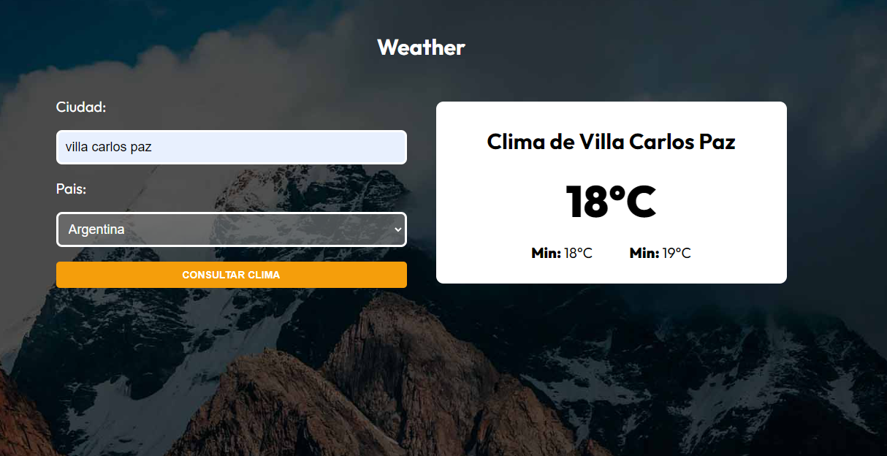

https://super-cuchufli-df401a.netlify.app/

# 🌦️ Weather App

This is a weather application that allows you to check the weather of different cities and countries around the world. It uses the [OpenWeatherMap](https://openweathermap.org/) API to provide accurate and up-to-date weather data.

## 🚀 Features

- Get the current weather for any city or country.
- Information on temperature.
- Input validation to ensure correct city and country search.
- Simple and user-friendly design.

## 📸 Preview

## 🛠️ Technologies used

- **OpenWeatherMap API**: To fetch weather data.
- **Axios**: To handle HTTP requests.
- **Zod**: For input data validation to ensure correct information.
