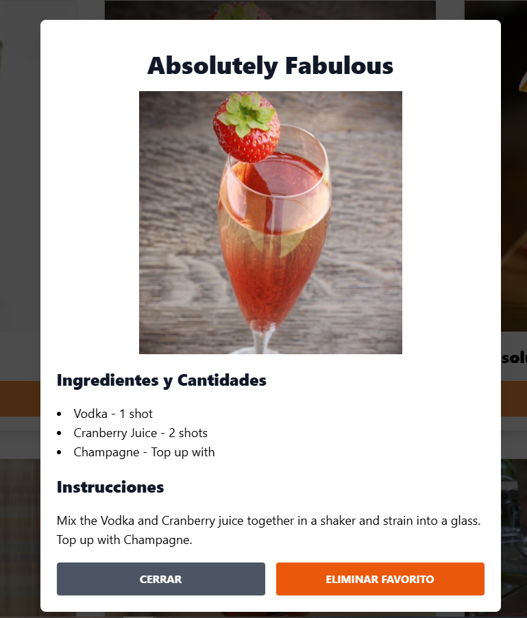

https://silly-torrone-276e56.netlify.app/

# 🍹 Cocktail Recipe Finder

Welcome to **Cocktail Recipe Finder**, a React-based web app that helps you discover a wide range of cocktail recipes. This app leverages the [TheCocktailDB API](https://www.thecocktaildb.com/api.php) to provide detailed cocktail information, including ingredients and preparation steps, making it easier to find the perfect drink for any occasion!

## ✨ Features

- **Search by cocktail name** - Easily look up any cocktail you have in mind.
- **Ingredient details** - View all ingredients and their measurements.
- **Favorites** - Save your favorite recipes.
- **Responsive design** - Enjoy the app on any device, optimized for both mobile and desktop use.

## 🚀 Tech Stack

The app is built with:

- **React 18** for building a fast, responsive user interface.
- **Zustand** for state management, simplifying the data flow.
- **React Router DOM** for seamless navigation.
- **Axios** for making API requests to TheCocktailDB.
- **Zod** for schema validation, ensuring data consistency.
- **Headless UI** and **Heroicons** for accessible and visually pleasing UI components.

## 📦 Dependencies

Here is a list of main dependencies used in the project:

```json
{
  "@headlessui/react": "^2.2.0",
  "@heroicons/react": "^2.1.5",
  "axios": "^1.7.7",
  "react": "^18.3.1",
  "react-dom": "^18.3.1",
  "react-router-dom": "^6.27.0",
  "zod": "^3.23.8",
  "zustand": "^5.0.0"
}
```




