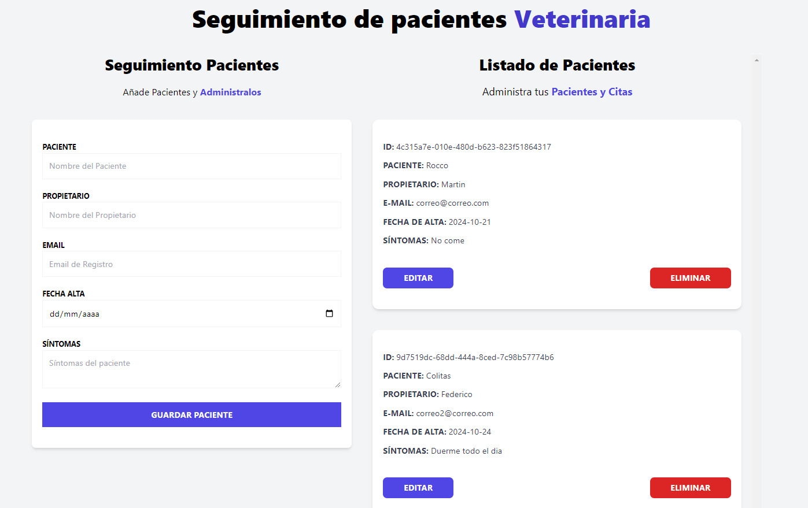

https://poetic-squirrel-785041.netlify.app/

# 🐾 Veterinary Appointment Booking App

This is a React-based web application for scheduling veterinary consultations. Users can select a date and time for their pets' appointments, and the application provides a simple and efficient interface for managing these bookings.

## 🌟 Features

- **Book Appointments**: Easy-to-use appointment booking form with validation.
- **Appointment Management**: State management handled with **Zustand** and local storage for persistence.
- **Form Validation**: Integrated with **react-hook-form** for seamless form validation.
- **Notifications**: Real-time notifications using **react-toastify**.
- **Unique IDs**: Appointment entries are assigned unique IDs using **uuid**.

## 🛠 Dependencies

- [`react-hook-form`](https://react-hook-form.com/) `^7.53.1`: Simplifies form handling and validation.
- [`react-toastify`](https://fkhadra.github.io/react-toastify/) `^10.0.6`: Adds beautiful toast notifications for feedback.
- [`uuid`](https://www.npmjs.com/package/uuid) `^10.0.0`: Generates unique IDs for appointments.
- [`zustand`](https://github.com/pmndrs/zustand) `^5.0.0`: For lightweight and efficient state management with local storage.
